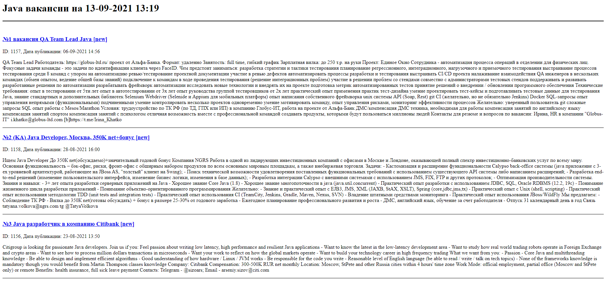

# job4j_grabber

+ [О проекте](#0-проекте)
+ [Технологии](#Технологии)
+ [Запуск и сборка](#Сборка-и-запуск)
+ [Использование](#Использование)
+ [Контакты](#Контакты)

## О проекте

Система запускается по расписанию. Период запуска указывается в настройках - grabber.properties. Программа считывает все 
вакансии с сайта [sql.ru](sql.ru) относящиеся к Java и записывает их в базу. Отображает вакансии
в порядке убывания по дате создания.

## Технологии

+ Сборщик проектов **Maven**;
+ Backend - **Java 14**;
+ Логгирование - **Log4j**, **Slf4j**;
+ СУБД - **PostgreSQL**;
+ Непрерывная интеграция - **Travis CI**;
+ Инструмент для анализа стиля кода - **Checkstyle**;

## Сборка и запуск

### Запуск через терминал

1.Собрать jar через Maven

`mvn install -Dmaven.test-skip=true`

2.Запустить jar файл

`java -jar target/grabber.jar`

### Запуск через IDE

Перейти к папке `src/main/java` и файлу `ru.job4j.grabber.Grabber`

## Использование

## Контакты

Становов Семён Сергеевич

Email: sestanovov@gmail.com

Telegram: [@stanovovss](https://t.me/stanovovss)